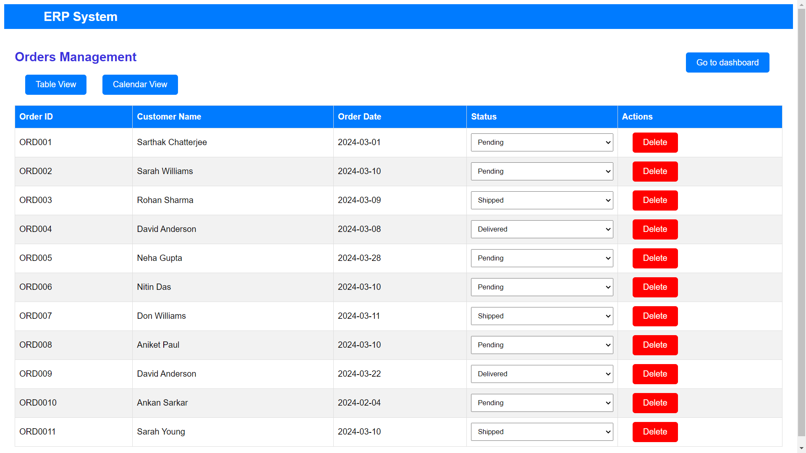
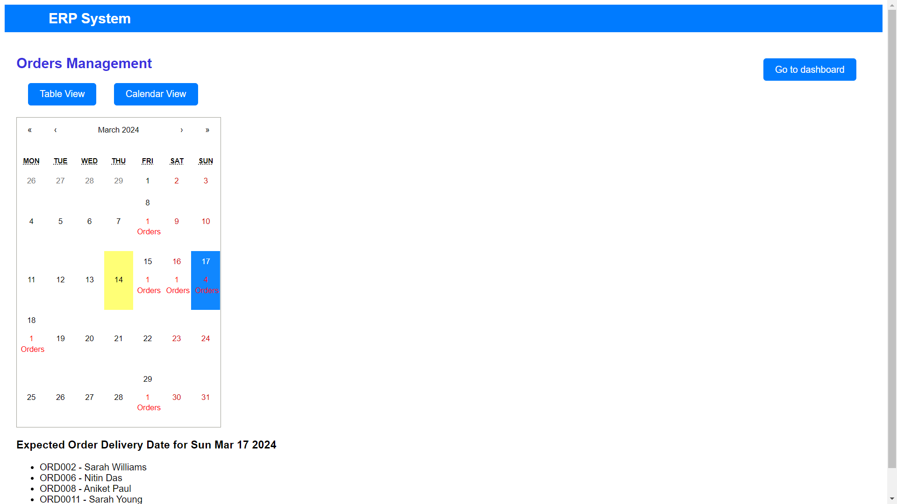

Screen Shots:

# Simplified ERP System with React - Documentation

Welcome to the Simplified ERP System built with React! This documentation will guide you through setting up and interacting with the website.

*Website URL*
You can access the website at the following URL: https://erp-system-with-entnt.vercel.app

*Setup Instructions*
No setup is required as the website is hosted on Vercel. Simply click on the provided URL to access the ERP system.

*Interacting with the Website*
The website consists of the following pages:

1. Dashboard: Provides an overview of key metrics and features of the ERP system. You'll find summaries of the total number of products and orders, along with buttons for quick navigation to the Products and Orders management pages.

2. Products Management: This page allows you to manage product listings. You can view a list of products with details such as name, category, price, and stock quantity. Additionally, functionalities to add, edit, and delete products are enabled.

3. Orders Management: Here, you can view and handle orders. A list of orders is displayed, including details such as order ID, customer name, order date, and status. Optionally, you can view order details, update the order status, and delete orders.

4. Orders Calendar View : If implemented, this page provides a calendar interface displaying orders based on their expected delivery dates. You can click on a date to view all orders due for delivery on that day.

*Key Features*
1. React Components: The project is built using modular React components, ensuring better organization and reusability.
2. React Router: Navigation between different sections of the ERP system is implemented using React Router, providing a seamless user experience.
3. Responsive Design: The website is designed to be responsive, ensuring optimal viewing experience across various devices, including desktop and mobile.

*Additional Notes*
1. Mock Data: The project uses mock data for products and orders for demonstration purposes. You can customize or replace this data with real data from your backend system.
2. Orders Calendar View Features: The Orders Calendar View is an optional feature that provides a visual representation of orders based on their expected delivery dates.

# *Workflow for Creating and Building a React App*

# Initialize React App:

Use create-react-app to bootstrap your React project. This command sets up a new React project with all the necessary files and dependencies:

### `npx create-react-app frontend`

Project Structure:

Explore the project structure created by create-react-app. You'll find files and directories such as src, public, package.json, README.md, etc.
The src directory contains your React components and other JavaScript files.
Development:

Open the project in your preferred code editor (e.g., Visual Studio Code).

Start the development server to see your changes in real-time:

### `npm start`

This command will launch a development server and open your default web browser with the React app running. Any changes you make to the code will be automatically reflected in the browser.